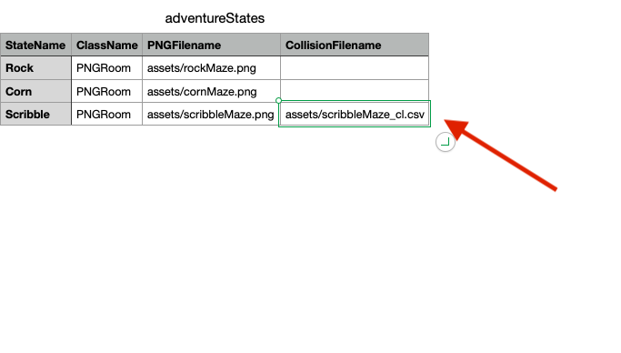
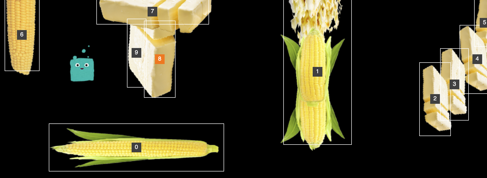
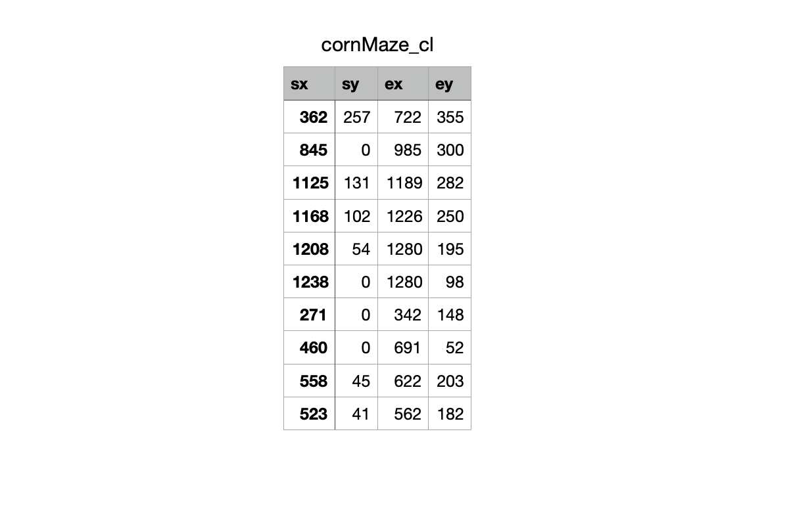
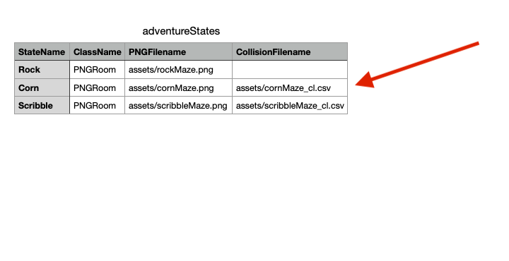
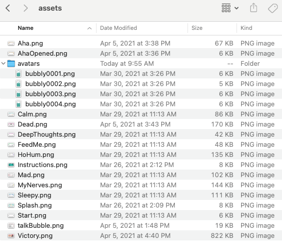
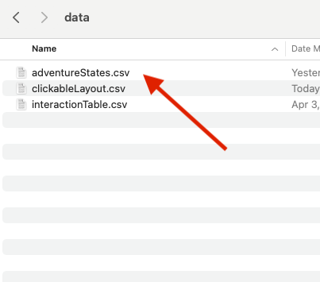
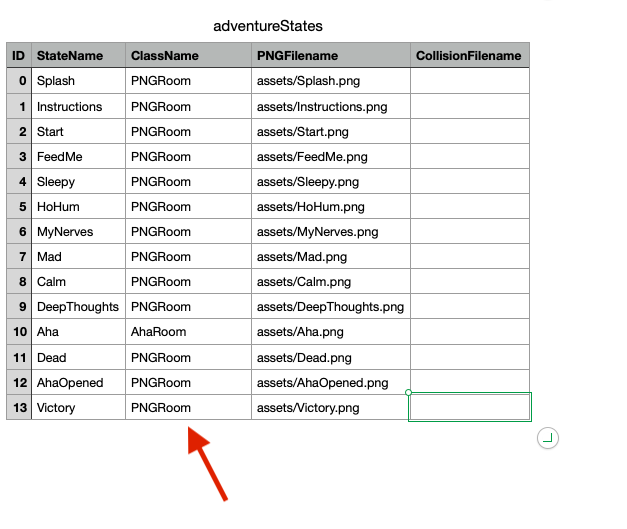

# Collision Mapper
### part of p5.2DAdventure
#### by Scott Kildall
www.kildall.com

## Overview
###Collision Mapper
This is a utility for 2D  Adventure that generates a collision file that you can load into your your adventureStates.csv fle.

What the collision file will do is specify a series of inivisble rectangular areas where your player sprite cannot move into. This is helpful for mazes, fences, walls and other items.

Each room will have its own collision file. These will be specifed as a column entry in the CollisionFilename folder.
 

### Steps:

##### Getting used to the environment
(1) Make a copy of CollisionMapper for your own use, leaving the samples files intact.

(2) Start your localhost and run the p5 sketch inside CollisionMapper. Get comfortable with how to use it and navigate through the screens with the Corn Maze, Rock Maze and Scribble Maze. 

The Scribble Maze has a collision file associated with it, but the other two are empty, as there is no collision file associated with it.

Try making some collision rectangles on the corn maze, like this. You can overlap rectangles.

If you start drawing and don't like the rectangle you've made, you can press ESCAPE in mid-draw. You can always delete the rectangles as well.

It should look something like this. The avatar should also not be able to get past the selected areas.

Be patient with the glitches! And let me know if there are any problems.

 

(3) Output the collision file by pressing [s] (make sure CAPS lock is off). This should save it to your downloads folder and make a variation on your PNG filename.

If you look at the file (not necessary, but just for curiosity), it looks like this. the sx, sy, ex, ey are just two (x,y) points that show where you can't ove.

 

(4) Now, copy the cornMaze_cl.csv to your assets folder, where your PNG files live.

(5) Edit the adventureStates and add the CSV name to  the CollisionFilename field.

You can always use a text editor to edit this, or a spreadsheet and export to CSV. Just be careful if you do it in a text editor to proper placement for commas, etc.

**Makes sure to include the proper pathname here**

 

(6) Clear your browser caches and edit your file

##### Using for your Adventure

(1) Copy all your Room assets to the assets folder. You shoudn't need any other assets, as we will just be using the rooms and no other interactivity code.

Please leave the bubbly avatar in the avatars folder.

 

(2) Copy your adventureStates.csv file to the data directory, replacing the existing one (this is why we work with a **copy**)

 

(3) Edit your adventureStates.csv to make sure all the class names fields say PNGRoom. We do this because since we are using only code in the AdventureManager and CollisionMapper, not any of your custom code

 

(4) Launch the localhost, clear your cache, run the JavaScript console window and cycle through the rooms with the CollisionMapper.

If there are any errors, they should show up in the JavaScript console window and are likely one of two things:

(a) you didn't copy the room PNG assets into the assets folder

(b) you didn't change the class names to PNGRoom

(5) With just ONE ROOM and a simple example, repeat steps 2-5 in the Getting Used to the Environment.

Keep your JavaScript console window open, looking for errors.

(6) Once you get the hang of it, you can do more than one room at a time, but start with just ONE room at a time for the first couple of rooms.

## Known issues 
** 1st screen won't display the collision rects, need to go to Next and then Previous for it to display properly

## License
CC BY: This license allows reusers to distribute, remix, adapt, and build upon the material in any medium or format, so long as attribution is given to the creator. The license allows for commercial use.
